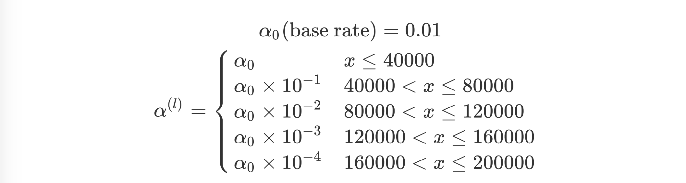
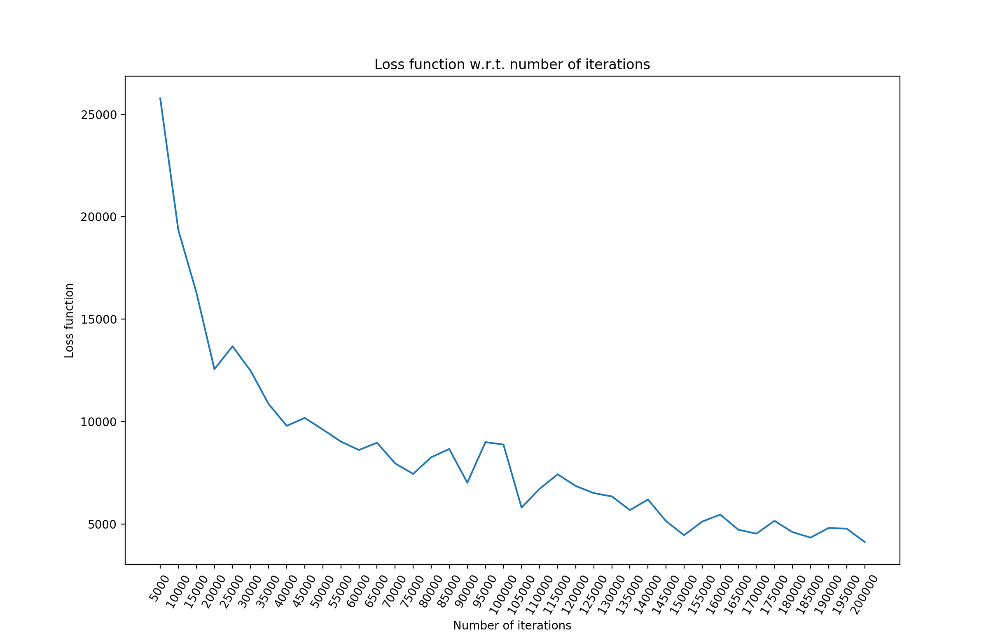
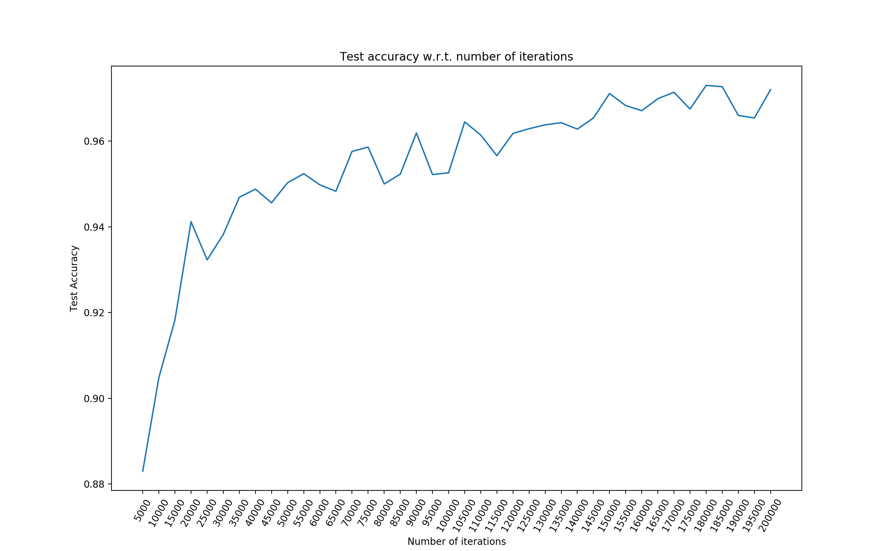

# Neural Network on MNIST with NumPy from Scratch
Implement and train a neural network from scratch in Python for the MNIST dataset (no PyTorch).

## Project Description:

Implement and train a neural network from scratch in Python for the MNIST dataset (no PyTorch). The neural network should be trained on the Training Set using stochastic gradient descent. It should achieve 97-98% accuracy on the Test Set. 

## Implementation

In my code, I defined an object  `NN` to represent the model and contain its parameters. I first initialize a random set of parameters, and then I use stochastic logistic regression algorithm to train the neural network model with data replacement. Then I test the data based on the training dataset to get the accuracy score. Below are the related parameters I used.

    # set the number of iterations
    num_iterations = 200000
    # set the base learning rate
    learning_rate = 0.01
    # size of hidden layer
    hidden_size = 300

Note that I implemented a learning rate schedule as follows:

I wrote 8 methods including `__Softmax(z)`, `__activfunc(self,Z,type = 'ReLU')`, `__cross_entropy_error(self,v,y)`, `__forward(self,x,y)`, `__back_propagation(self,x,y,f_result)`, `__optimize(self,b_result, learning_rate)`, `train(self, X_train, Y_train, num_iterations = 1000, learning_rate = 0.5)`, `testing(self,X_test, Y_test)` to handle initialization, model fitting and testing.

## Test Accuracy 
The test accuracy and value of loss function with respect to the number of iterations within one time of modeling are shown as follows. Note the test eventually has achieved an accuracy score of around 97%. (**Sample test**: accuracy = 97.2%)

